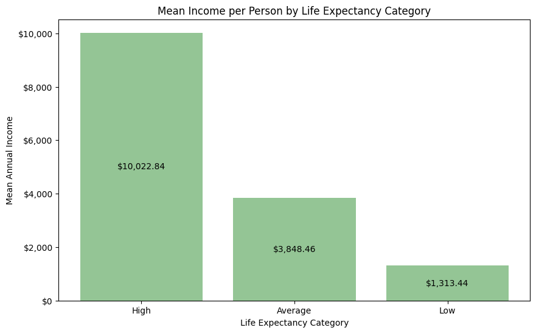
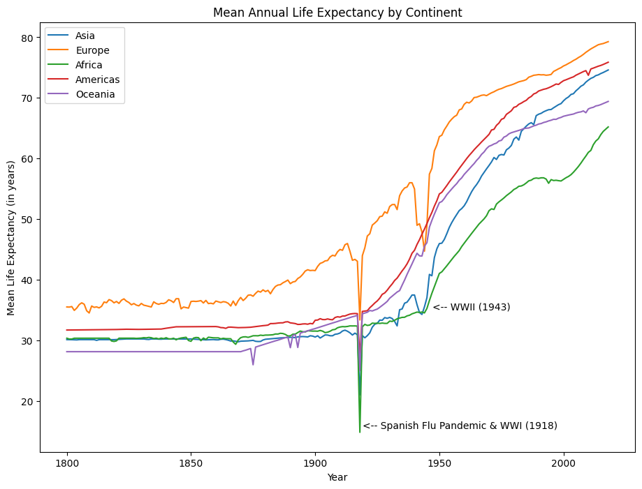
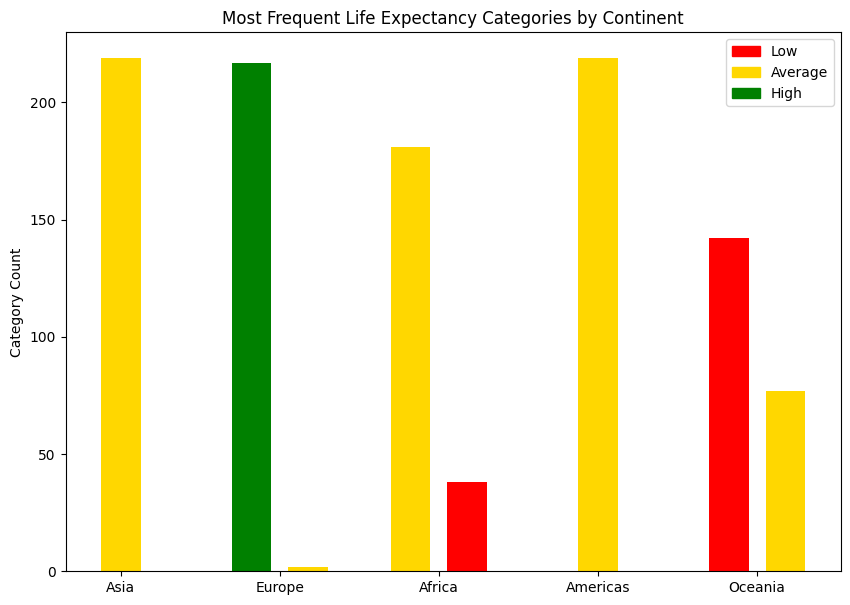
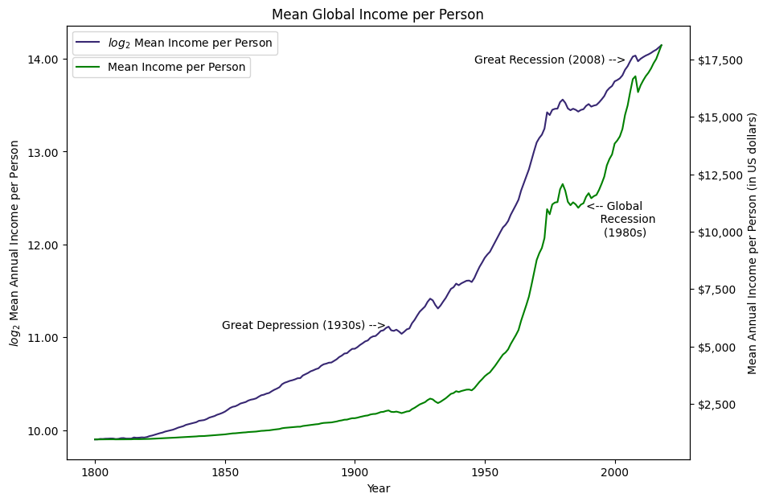
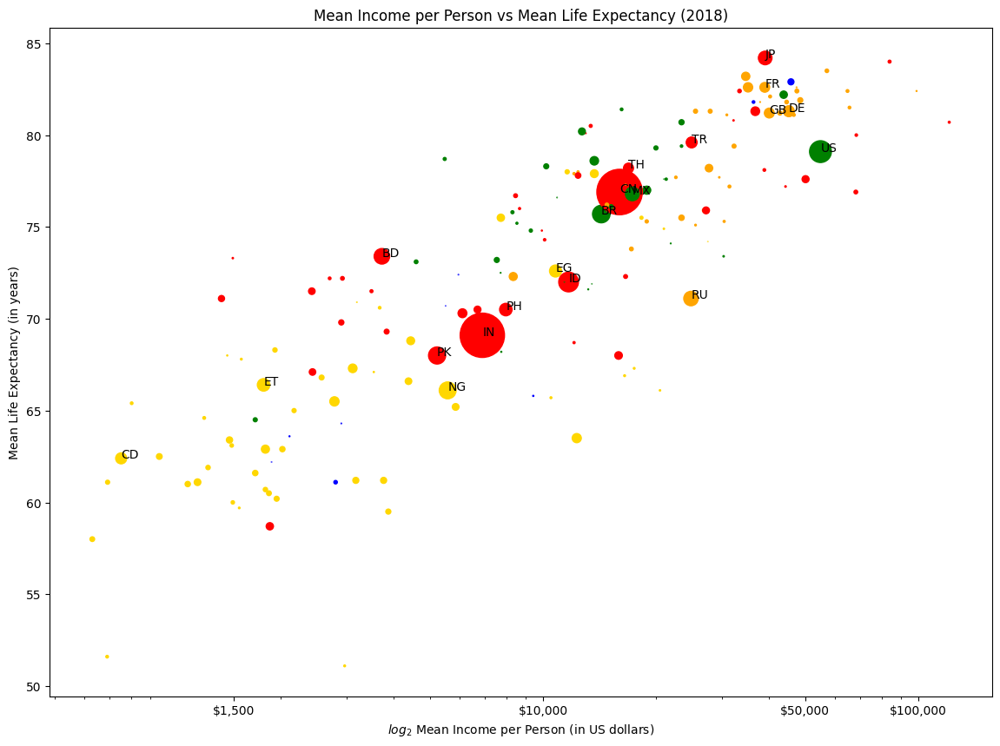

# Predicting Countries' Life Expectancy

**Table of Contents**
 [Background](#background)
 [Executive Summary](#executive-summary)
 [EDA](#exploratory-data-analysis)
 [Modeling](#modeling)
 [Results](#results)

# Background

As a humble ode to Hans Rosling's [Gapminder](https://www.gapminder.org/about/), we've analyzed the socioeconomic factors of 171 countries, from 1800 to 2018, and how these play a role in the average life expectancy of each country.

# Executive Summary

**Problem Statement**:

Life expectancy is an abstract measure of the number of years a person can expect to live, and varies based on several factors, some of which are less visible than others. We've combined multiple datasets that include information like average income person, population, and geological region of individual countries across three centuries.

Our goal is to build a regression model that can predict a country's average life expectancy, as well as a classification model that can predict a country's life expectancy category (low, medium, or high for a given year) based on the same features. Our benchmark of success will be a minimum 0.85 R2 score and maximum 5 RMSE for our regression model, and at least 85% accuracy for our classification model.

**Approach & Goal**:

We'll first need to reformat the data to make it usable within our model. From there, we will test various regression and classification models with RMSE and accuracy being our main measures of performance, respectively. In our classification analysis, we'll be looking at additional metrics like specificity, precision, and recall.

# Exploratory Data Analysis
Notebook can be viewed [here](./notebooks/02_eda.ipynb).

The purpose of this notebook is to explore the relationships between our original and engineered features. This will help us hone in on the most useful variables that should be used during modeling.

Following are examples of the explorations conducted:

#### **What is the mean income per person for each life expectancy category?**

#### **How has the mean life expectancy been affected in each continent after critical global events?**

#### **Are we able to provide additional context around the life expectancy categories seen most often in each continent?**

#### **How did the mean income per person change between the 19th and 21st centuries?**

#### **Can we look at mean income per person and life expectancy for all countries in a given year?**

#### **Can we plot the same as above, but dynamically so that it changes for each year and allows us to compare relative growth over time?**
- Yes, we can! To view this dynamic plot, please visit [this link](https://public.tableau.com/app/profile/cynthia.rodriguez6815/viz/GapminderRecreation_16710692756720/Gapminder).

# Modeling
Notebook can be found [here](03_modeling.ipynb).

We ran a total of 12 regression models, first with just the original dataset columns, then with the engineered feature additions.

Our best regression model was the Random Forest Regressor, and achieved an RMSE of 1.63 and an R2 of 0.99. If we were selecting a production model based on RMSE alone, Random Forest is the clear champion with our Bagging Regressor following closely behind. However, we are also taking our models' variance into account, as we cannot proceed with any model that is overfit on the training set and will perform poorly on unseen data.

With this in mind, our final model would likely be either KNN, which achieved an RMSE of 2.05, and train/test R2 scores of .991 and .984, respectively, or our Gradient Boost model that produced a moderately higher RMSE of 3.87, but also had two of the closest train/test R2 scores of .948 and .944, respectively.

For our classification models, the setup was similar, though this time we were trying to predict either 'low,' 'medium,' or 'high' life expectancy class based on countries' mean income per person, geo, and population.

The top-scoring models were, again, the Random Forest and Bagging classifiers. These two performed almost identically across various metrics, and both achieved accuracy scores of 0.978 (Random Forest edged out the Bagging model by just 0.000214). However, the Bagging model outperformed RF in one area - overfitness. Both models had moderate variance, but the gap between the train and test scores for the Bagging model was slightly smaller than that of RF.

Another frontrunner in our classification trials was the KNN Classifier, which scored 0.975 on accuracy and had even less variance than the Bagging Classifier.

# Results

We were able to meet our target metrics of 5 RMSE and 80% accuracy in our regression and classification models. Random Forest produced the best scores in our regression and classification trials, but was also one of the more overfit models in both. In terms of which models we'd move forward with in production, our KNN Regressor achieved an RMSE of just 2.05 and a test R2 score of 0.984. For classification, our KNN and Bagging classifiers both scored in the high 90s for accuracy and were less overfit than the Random Forest model.

All of that said, we believe there are more factors that play a role in a country's life expectancy than we saw in our data.

In future iterations, we'd like to expand our scope and use more features - specifically around a country's health and economic policies (free healthcare versus not, social security, capitalist countries and socialist countries, etc.). Additionally, we'd recommend adjusting the model hyperparameters. While we kept our models as basic as possible to maintain consistency, we do expect that tuning the top-performing models could lead to even better results.

From this, we believe that we would get a more comprehensive account of what goes into determining a country's life expectancy. After further testing and modification, our model could serve as the foundation for predicting a country's life expectancy in future global studies.
